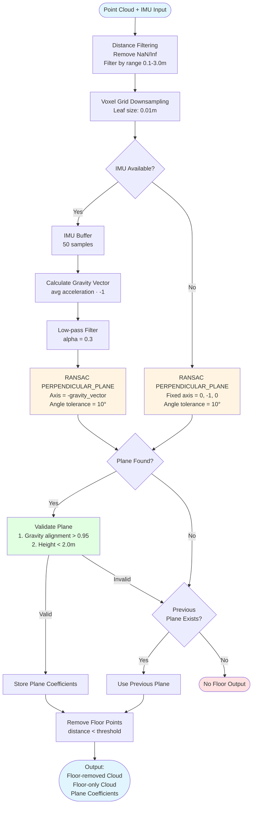

# D435i Floor Remover

ROS2 Foxy package for detecting and removing floor planes from Intel RealSense D435i point clouds using IMU-assisted plane segmentation.

## Key Features

- **IMU-Based Floor Detection**: Estimates gravity vector from D435i's built-in IMU to guide floor plane detection
- **PERPENDICULAR_PLANE RANSAC**: Constrains plane search to surfaces perpendicular to gravity, preventing wall misdetection
- **Modular Architecture**: Separates algorithm core from ROS node for better reusability
- **Real-time Performance**: Optimized for 30-60Hz operation
- **Gravity Vector Visualization**: Real-time visualization of estimated gravity direction in RViz

## Architecture

### Module Structure

```
D435i_floor_remover/
├── include/D435i_floor_remover/
│   └── floor_remover.hpp          # Algorithm core header
├── src/
│   ├── floor_remover.cpp          # Algorithm core implementation (ROS-independent)
│   └── server_node.cpp            # ROS2 node wrapper
├── config/
│   └── floor_remover_params.yaml  # Parameter configuration
├── launch/
│   └── floor_remover.launch.py    # Launch file
└── CMakeLists.txt                 # Library + executable build
```

### Processing Pipeline

1. **Point Cloud Input** (`/camera/depth/color/points`)
   - Receives RGB-D point cloud from D435i

2. **Distance Filtering & Cleanup**
   - Removes NaN/Inf points
   - Filters by valid distance range (0.1m - 3.0m)

3. **Voxel Grid Downsampling**
   - Reduces noise and improves processing speed
   - Leaf size: 0.01m (1cm)

4. **Floor Plane Detection**
   - IMU gravity vector-based PERPENDICULAR_PLANE RANSAC
   - Gravity alignment validation
   - Height range validation

5. **Floor Removal & Output**
   - Publishes floor-removed point cloud (`/floor_removed_cloud`)
   - Publishes floor-only point cloud (`/floor_cloud`)

## Algorithm Details

### Floor Detection Flow



### IMU-Based Gravity Vector Estimation

```cpp
// Average acceleration over IMU buffer
Eigen::Vector3d acc_sum = average(imu_buffer_);

// When stationary, acceleration points opposite to gravity
Eigen::Vector3d new_gravity = -acc_sum.normalized();

// Low-pass filter to reduce noise (configurable alpha)
gravity_vector_ = alpha * new_gravity + (1.0 - alpha) * gravity_vector_;
```

**Parameters:**
- IMU buffer size: 50 samples
- Filter alpha: 0.3 (fast response, moderate stability)

### PERPENDICULAR_PLANE RANSAC

Standard RANSAC finds the "largest plane", which often detects walls.
Instead, we constrain RANSAC to search only for **planes perpendicular to gravity**, accurately identifying the floor.

```cpp
if (use_imu_for_validation_ && !imu_buffer_.empty()) {
  Eigen::Vector3d floor_axis = -gravity_vector_;  // Floor direction
  seg.setModelType(pcl::SACMODEL_PERPENDICULAR_PLANE);
  seg.setAxis(Eigen::Vector3f(floor_axis.x(), floor_axis.y(), floor_axis.z()));
  seg.setEpsAngle(0.17);  // ~10 degrees tolerance
}
```

**Validation Steps:**
1. **Gravity Alignment**: Plane normal · gravity vector > 0.95
2. **Height Range**: Floor height < 2.0m, > -0.5m

### Floor Removal

Plane equation distance calculation:
```cpp
distance = plane_coeffs[0] * x + plane_coeffs[1] * y +
           plane_coeffs[2] * z + plane_coeffs[3]
```

- `|distance| < plane_distance_threshold` → Classified as floor
- `distance > 0 && distance < max_height_threshold` → Classified as object

## Dependencies

```bash
# ROS2 Foxy
sudo apt install ros-foxy-desktop

# PCL and related libraries
sudo apt install ros-foxy-pcl-ros ros-foxy-pcl-conversions libpcl-dev

# Eigen3
sudo apt install libeigen3-dev

# RealSense ROS2 wrapper
sudo apt install ros-foxy-realsense2-camera
```

## Installation & Build

```bash
# Navigate to workspace
cd ~/catkin_rs

# Build package
colcon build --packages-select D435i_floor_remover

# Source workspace
source install/setup.bash
```

## Usage

### 1. Launch RealSense Camera

```bash
ros2 launch realsense2_camera rs_launch.py \
  enable_depth:=true \
  enable_color:=true \
  enable_pointcloud:=true \
  enable_gyro:=true \
  enable_accel:=true \
  unite_imu_method:='linear_interpolation' \
  pointcloud.enable:=true
```

### 2. Launch Floor Remover Node

```bash
# Using launch file
ros2 launch D435i_floor_remover floor_remover.launch.py

# Or run directly
ros2 run D435i_floor_remover floor_remover_node --ros-args \
  --params-file src/D435i_floor_remover/config/floor_remover_params.yaml
```

### 3. Visualize in RViz

```bash
rviz2
```

Add these displays in RViz:
- **PointCloud2**: `/camera/depth/color/points` (original)
- **PointCloud2**: `/floor_removed_cloud` (floor removed)
- **PointCloud2**: `/floor_cloud` (floor only)
- **Marker**: `/gravity_vector` (gravity vector arrow)

## Parameter Configuration

File: [config/floor_remover_params.yaml](config/floor_remover_params.yaml)

### Topic Configuration

| Parameter | Default | Description |
|-----------|---------|-------------|
| `input_cloud_topic` | `/camera/depth/color/points` | Input point cloud topic |
| `input_imu_topic` | `/camera/imu` | Input IMU topic |
| `output_cloud_topic` | `/floor_removed_cloud` | Floor-removed point cloud topic |
| `floor_cloud_topic` | `/floor_cloud` | Floor-only point cloud topic |
| `gravity_marker_topic` | `/gravity_vector` | Gravity vector visualization marker topic |

### Distance Filtering

| Parameter | Default | Description |
|-----------|---------|-------------|
| `min_distance` | 0.1m | Minimum valid distance (D435i recommended: 0.3m) |
| `max_distance` | 3.0m | Maximum valid distance (indoor recommended: 3-5m) |

### Voxel Downsampling

| Parameter | Default | Description |
|-----------|---------|-------------|
| `voxel_leaf_size` | 0.01m | Voxel size (smaller = more detail, slower) |

**Recommended range:** 0.005m - 0.02m

### RANSAC Plane Detection

| Parameter | Default | Description |
|-----------|---------|-------------|
| `plane_distance_threshold` | 0.01m | Plane inlier distance threshold |
| `plane_max_iterations` | 300 | RANSAC maximum iterations |

### IMU Configuration

| Parameter | Default | Description |
|-----------|---------|-------------|
| `imu_buffer_size` | 50 | IMU sample buffer size (for gravity estimation) |
| `use_imu_for_validation` | true | Use IMU-based floor validation |
| `gravity_filter_alpha` | 0.3 | Low-pass filter coefficient (0.0-1.0) |

**Important:** Setting `use_imu_for_validation: false` uses fixed vector `[0, -1, 0]`

**Gravity Filter Alpha:**
- Higher values (e.g., 0.4): Faster response, more noise
- Lower values (e.g., 0.2): Slower response, more stable
- Recommended: 0.2 - 0.4

### Floor Validation

| Parameter | Default | Description |
|-----------|---------|-------------|
| `max_height_threshold` | 2.0m | Maximum height from floor |
| `floor_normal_alignment_threshold` | 0.95 | Gravity alignment threshold (cos θ) |

**Alignment Threshold Explanation:**
- `1.0` = 0° (perfectly horizontal floor)
- `0.95` = ~18° (allows floor tilt up to 18°)
- `0.87` = 30° (allows up to 30°)
- `0.7` = 45° (allows up to 45°)

**Recommended:** 0.90-0.95 (stable floor detection)

## Tuning Guide

### For Better Accuracy

```yaml
voxel_leaf_size: 0.005              # Smaller voxels
plane_distance_threshold: 0.008     # Stricter inlier criteria
plane_max_iterations: 500           # More RANSAC iterations
floor_normal_alignment_threshold: 0.95  # Stricter alignment requirement
```

### For Better Speed

```yaml
voxel_leaf_size: 0.02               # Larger voxels
plane_max_iterations: 100           # Fewer iterations
use_imu_for_validation: true        # IMU mode required
```

### For Uneven Floors

```yaml
plane_distance_threshold: 0.02      # More tolerant inlier criteria
floor_normal_alignment_threshold: 0.85  # Allow larger angles
```

### For Sloped Environments

```yaml
use_imu_for_validation: true        # IMU-based validation required
floor_normal_alignment_threshold: 0.7   # Allow up to 45°
gravity_filter_alpha: 0.2           # More stable gravity estimation
```

## Topics

### Subscribed Topics

- **`input_cloud_topic`** (sensor_msgs/PointCloud2)
  - RGB-D point cloud published by D435i
  - Frame: `camera_depth_optical_frame`

- **`input_imu_topic`** (sensor_msgs/Imu)
  - D435i built-in IMU data
  - `linear_acceleration`: Used for gravity vector estimation
  - `angular_velocity`: Currently unused (future: dynamic filtering)

### Published Topics

- **`output_cloud_topic`** (sensor_msgs/PointCloud2)
  - Point cloud with floor removed
  - Same frame as input

- **`floor_cloud_topic`** (sensor_msgs/PointCloud2)
  - Points classified as floor only
  - For debugging and visualization

- **`gravity_marker_topic`** (visualization_msgs/Marker)
  - Visualizes current estimated gravity vector as arrow
  - Red arrow (length: 0.02m)

## Performance

**Test Environment:**
- CPU: Intel i7 (typical laptop)
- Input: 640×480 point cloud (~300k points)
- After voxel filtering: ~30k points

**Performance Metrics:**
- Processing time: 10-30ms/frame
- Frame rate: 30-60 Hz

## Troubleshooting

### Floor Not Properly Detected

**Symptoms:**
- Walls detected as floor
- Floor not found

**Solutions:**
```bash
# 1. Check IMU data
ros2 topic echo /camera/imu --no-arr

# 2. Verify gravity vector
ros2 topic echo /gravity_vector

# 3. Adjust parameters
# Lower floor_normal_alignment_threshold (e.g., 0.90)
# Increase plane_distance_threshold (e.g., 0.02)
```

### No Output Point Cloud

```bash
# Check topics
ros2 topic list | grep floor

# Check node status
ros2 node list
ros2 node info /floor_remover_node

# Check input topics
ros2 topic hz /camera/depth/color/points
ros2 topic hz /camera/imu
```

### Slow Processing

1. **Increase voxel_leaf_size**: `0.02` or higher
2. **Decrease plane_max_iterations**: `100` or lower
3. **Reduce distance range**: `max_distance: 2.0`

### Inaccurate Gravity Vector

```bash
# Check IMU sample rate
ros2 topic hz /camera/imu

# Increase buffer size (more stable)
imu_buffer_size: 100

# Decrease filter alpha (more stable, slower response)
gravity_filter_alpha: 0.2

# Or use fixed vector
use_imu_for_validation: false
```

## Code Structure

### FloorRemover Class (floor_remover.cpp)

ROS-independent algorithm core:

```cpp
class FloorRemover {
public:
  // IMU update
  void updateImu(const sensor_msgs::msg::Imu::SharedPtr& msg);

  // Point cloud processing
  bool processPointCloud(
    const pcl::PointCloud<pcl::PointXYZRGB>::Ptr& input_cloud,
    pcl::PointCloud<pcl::PointXYZRGB>::Ptr& output_cloud_no_floor,
    pcl::PointCloud<pcl::PointXYZRGB>::Ptr& output_floor_only,
    Eigen::Vector4d& plane_coefficients
  );

private:
  bool findFloorPlane(...);           // RANSAC plane detection
  void removeFloorPlane(...);         // Floor removal
  void updateGravityVector();         // Gravity vector estimation
};
```

### FloorRemoverNode Class (server_node.cpp)

ROS2 node wrapper:

```cpp
class FloorRemoverNode : public rclcpp::Node {
private:
  void cloudCallback(const sensor_msgs::msg::PointCloud2::SharedPtr msg);
  void imuCallback(const sensor_msgs::msg::Imu::SharedPtr msg);
  void publishGravityMarker(const std_msgs::msg::Header& header);

  std::unique_ptr<floor_remover::FloorRemover> floor_remover_;
};
```

## Known Limitations

- Floor slope: 18° or less recommended (with default threshold)
- Minimum distance: 0.1m (D435i hardware constraint: 0.3m recommended)
- IMU accuracy degrades during rapid camera motion
- Detection fails when floor is completely out of view

## Future Improvements

- [ ] Multi-plane segmentation for stair detection
- [ ] Enhanced IMU filtering for dynamic environments (Kalman Filter)
- [ ] GPU acceleration (CUDA PCL)
- [ ] Multi-camera support
- [ ] Optional temporal smoothing of plane coefficients

## License

MIT License

## Author

Jay

## References

- [Intel RealSense D435i](https://www.intelrealsense.com/depth-camera-d435i/)
- [Point Cloud Library (PCL) RANSAC](https://pointclouds.org/documentation/tutorials/random_sample_consensus.html)
- [ROS2 Foxy Documentation](https://docs.ros.org/en/foxy/)
- [PCL SACMODEL_PERPENDICULAR_PLANE](https://pointclouds.org/documentation/classpcl_1_1_sample_consensus_model_perpendicular_plane.html)
